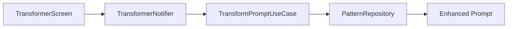

# Examples — pa-ai-document

## Example 1: Medium priority feature from free-text request

**Input:**
```
FEATURE_REQUEST: Add a history screen that lists the last 50 transformed prompts, allowing the user to tap any item to copy it.
PRIORITY: Medium
```

**Output file:** `lib/features/history/FEATURE.md`

**Document (abbreviated):**
```markdown
# History Screen

## Summary
Displays the 50 most recently transformed prompts in a scrollable list.
Tapping an item copies the enhanced prompt to the clipboard.

## Business Rules
- At most 50 entries are stored; oldest entry is evicted when limit is exceeded.
- Empty input transformations are not saved to history.
- History persists across app restarts using local storage.

## Architecture Overview
**Layers affected:** Presentation / Domain / Data

**Data flow:**
User tap → HistoryNotifier → GetHistoryUseCase → HistoryRepository → List<HistoryEntry>

**Key providers:**
- `historyNotifierProvider` — manages history list state
- `getHistoryUseCaseProvider` — provides the use case

## Key Files & Symbols

| File | Symbol | Purpose |
|---|---|---|
| `lib/features/history/presentation/screens/history_screen.dart` | `HistoryScreen` | Renders the history list |
| `lib/features/history/domain/usecases/get_history_use_case.dart` | `GetHistoryUseCase` | Retrieves entries from repository |
| `lib/features/history/data/repositories/history_repository_impl.dart` | `HistoryRepositoryImpl` | Persists history to local storage |

## Edge Cases & Error Handling
- Empty history → show empty state widget with "No history yet" message
- Storage read failure → show error snackbar, list remains empty

## Sources
- Jira: N/A
- Files read: lib/features/history/
- Generated: 2026-05-08
```

---

## Example 2: High priority from Jira ticket

**Input:**
```
JIRA: PA-42
PRIORITY: High
```

**Execution:**
1. Fetches PA-42 via `mcp__claude_ai_Atlassian__getJiraIssue`
2. Passes through `pa-semantic-filter` to strip any sensitive content
3. Reads relevant feature files from codebase
4. Generates document with all sections + mermaid diagram

**Output file:** `lib/features/transformer/FEATURE.md`

The Architecture Overview section additionally contains:


---

## Example 3: Low priority quick doc

**Input:**
```
FEATURE_REQUEST: Add a share button to copy the enhanced prompt to clipboard.
PRIORITY: Low
```

**Output file:** `lib/features/transformer/FEATURE_SHARE.md`

Only three sections are populated: Summary, Business Rules, and Key Files & Symbols. All other sections are omitted.
