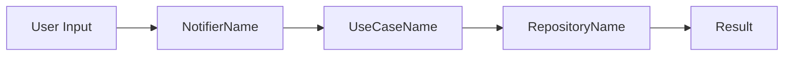

# Prompt — pa-ai-document

Step-by-step execution workflow for feature document generation.

## Step 0: Pre-flight

- Apply `pa-anti-hallucination` — verify all symbols, file paths, and provider names against the live codebase before writing anything.
- Read `README.md` and `.claude/CLAUDE.md` to load project context (stack, architecture, feature list).

## Step 1: Gather Sources

```bash
# Get changed files for context
git diff main...HEAD --name-only | grep '\.dart$'

# Read relevant feature files
find lib/features/<feature> -name "*.dart" | head -20
```

If `JIRA` param is provided, fetch the ticket via Atlassian MCP:
```
mcp__claude_ai_Atlassian__getJiraIssue(issueKey: "<JIRA>")
Extract: summary, description, acceptance criteria, labels, priority
```

If `FILES` param is provided, read each listed file for symbols and business logic.

If `CONTEXT` param is provided, incorporate it into the business rules section.

## Step 2: Determine Output Path

Place the document co-located with the feature:
```
lib/features/<feature>/FEATURE.md
```

For cross-cutting or architectural features, place at:
```
docs/<feature-name>.md
```

## Step 3: Determine Depth from PRIORITY

- `High` → fill all sections + add mermaid data-flow diagram
- `Medium` → fill all sections, no diagram
- `Low` → fill Summary + Business Rules + Key Files only; mark other sections "N/A"

## Step 4: Generate Document

Write the document to the determined output path using the template in OUTPUT_SCHEMA.md.

Rules while writing:
- Every file path must exist in the codebase (verified in Step 0).
- Every class/provider name must be confirmed via symbol search before inclusion.
- Business rules must reflect actual code behaviour, not assumptions.
- For `High` priority, include a mermaid diagram:



## Step 5: Confirm Output Path

Print the full path of the written file so the caller can open it immediately.
