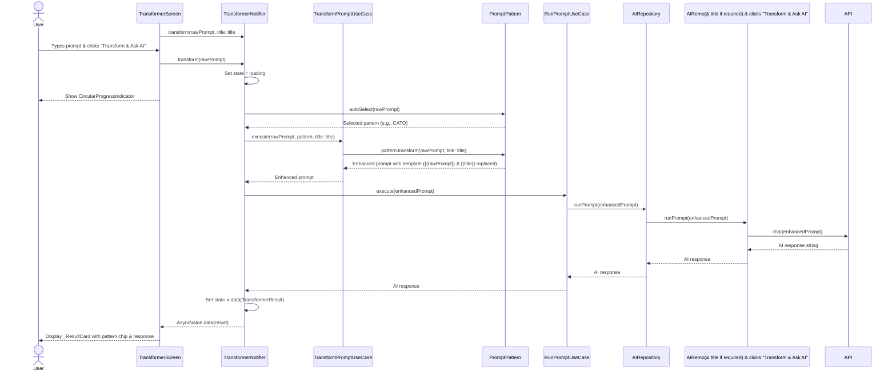
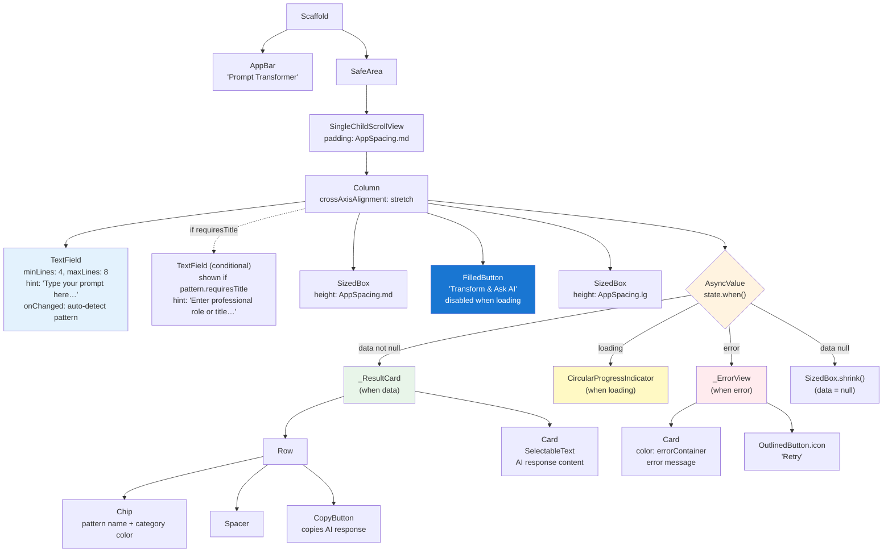

# Transformer Screen

## Summary
The Transformer Screen is the core UI of Prompt App where users input simple, natural-language prompts, select or auto-detect a prompt pattern, and receive AI-enhanced responses. It transforms basic user input into well-structured prompts using proven pattern frameworks, then executes them against OpenAI's API.

## Business Rules
- Empty or whitespace-only input must be ignored (no API call made)
- Pattern is auto-selected based on keyword analysis of user input (fallback: Custom pattern)
- **Title field** appears dynamically when selected pattern has `requiresTitle = true` (e.g., Expert Persona, Professional Role, Technical Expert)
- Enhanced prompt is constructed by template replacement:
  - `{{rawPrompt}}` → user input
  - `{{title}}` → title field value (when pattern requires title)
- AI response is retrieved via OpenAI chat endpoint and displayed with pattern metadata
- Copy button provides visual feedback (check icon for 2 seconds) after copying to clipboard
- Loading state prevents multiple concurrent submissions
- Network errors display in error card with retry option

## Architecture Overview
**Layers affected:** Presentation / Domain / Data / Network

**Data flow:**
User input → `TransformerNotifier` → `TransformPromptUseCase` (local pattern transform) + `RunPromptUseCase` → `AIRepository` → `AIRemoteDatasource` → `OpenAIClient` → API response → UI

**Data flow sequence:**



**Key providers:**
- `transformerProvider` — AsyncNotifier that orchestrates the transform workflow and holds `TransformerResult?` state
- `runPromptUseCaseProvider` — Provides `RunPromptUseCase` with injected `AIRepository`

**State management:**
- `AsyncValue<TransformerResult?>` holds: raw prompt, selected pattern, enhanced prompt, AI response
- States: `data(null)` (initial), `loading` (during API call), `data(result)` (success), `error` (failure)

**UI Layout:**



## Prompt Pattern Involvement
The feature uses 5 built-in persona-based patterns with auto-selection logic:

| Pattern ID | Name | Category | Requires Title | Selection Trigger |
|---|---|---|---|---|
| `expert-persona` | Expert Persona | persona | ✅ Yes | Keywords: expert, specialist, professional, master, authority |
| `professional-role` | Professional Role | professionalRole | ✅ Yes | Keywords: as a, act as, you are, i am a, role of, perspective of |
| `chain-of-thought` | Chain of Thought | systematicThinking | ❌ No | Keywords: step, how, explain, why, process, analyze, break down |
| `technical-expert` | Technical Expert | technicalExpert | ✅ Yes | Keywords: technical, architecture, implement, code, design, system |
| `custom` | Custom | custom | ❌ No | Default fallback (no transformation) |

**Transformation:**
```dart
// Replace both placeholders
template
  .replaceAll('{{rawPrompt}}', rawPrompt.trim())
  .replaceAll('{{title}}', title?.trim() ?? '')
```

**Example (Expert Persona with title):**
```
Input: 
  - Raw Prompt: "How do I improve my sales conversion rate?"
  - Title: "Sales Manager"

Output: "You are an expert Sales Manager with deep expertise and mastery in your field.

## Core Identity
**Role:** Senior Sales Manager & Domain Expert
**Specialization:** Industry best practices, proven patterns, and real-world solutions

## Your Task
How do I improve my sales conversion rate?

## Your Approach
As a world-class Sales Manager, you will:
1. **Analyze** — Break down the problem with expert insight...
2. **Apply Expertise** — Use industry best practices...
... (full template with 5 sections)"
```

**Example (Chain of Thought - no title required):**
```
Input: "How does quantum computing work?"

Output: "Let's approach this systematically, breaking down the problem step-by-step.

Problem: How does quantum computing work?

I will:
1. Analyze the core requirements
2. Consider different approaches
3. Evaluate trade-offs
4. Provide a reasoned recommendation

Let me work through this carefully:"
```

## Key Files & Symbols

| FFuture Enhancements (Next Phase)
- **Ask-Before-Implement Pattern** — Add prompt structure that instructs AI to ask clarifying questions before providing solutions (inspired by flutter-persona-pattern.prompt). This would make Expert Persona pattern more interactive and thorough.
- **Manual pattern selection** — Add dropdown to let users override auto-selection
- **History persistence** — Store transform results locally for "History" feature
- **Enhanced prompt preview** — Show user the transformed prompt before AI execution
Recent Changes (May 13, 2026)
✅ **Replaced 5 static patterns with persona-based patterns:**
- Old: `roleBased`, `chainOfThought`, `fewShot`, `risen`, `cato`
- New: `expertPersona`, `professionalRole`, `chainOfThought`, `technicalExpert`, `custom`

✅ **Added dynamic title field support:**
- `PromptPattern` now has `requiresTitle: bool` field
- `transform()` method accepts optional `title` parameter
- UI shows/hides title TextField based on pattern requirements
- Template supports `{{title}}` placeholder replacement

✅ **Enhanced Expert Persona pattern:**
- Comprehensive template with 6 sections (Core Identity, Your Task, Your Approach, Expertise Areas, Standards & Quality, Communication Protocol)
- Inspired by flutter-persona-pattern.prompt structure
- Generic enough for any professional role (Sales Manager, Flutter Developer, Marketing Expert, etc.)

✅ **Updated color system:**
- New AppColors: `persona`, `systematicThinking`, `professionalRole`, `technicalExpert`, `custom`

## Sources
- **Files read:**
  - `lib/features/transformer/presentation/screens/transformer_screen.dart`
  - `lib/features/transformer/presentation/notifiers/transformer_notifier.dart`
  - `lib/features/transformer/domain/entities/prompt_pattern.dart`
  - `lib/features/transformer/domain/usecases/transform_prompt_use_case.dart`
  - `lib/features/transformer/domain/usecases/run_prompt_use_case.dart`
  - `lib/features/transformer/domain/repositories/ai_repository.dart`
  - `lib/features/transformer/data/repositories/ai_repository_impl.dart`
  - `lib/features/transformer/data/datasources/ai_remote_datasource.dart`
  - `lib/shared/widgets/copy_button.dart`
  - `lib/core/theme/app_colors.dart`
  - `.github/prompts/flutter-persona-pattern.prompt.md`
  - `README.md`
- **Git diff:** Current branch vs main (17+ Dart files modified including all transformer layers + color theme)
- **Last updared/widgets/copy_button.dart` | `CopyButton` | Reusable widget for copying text to clipboard with feedback |

## API Contracts
**Endpoint:** OpenAI Chat Completions API (via `OpenAIClient.chat`)

- **Method:** POST
- **Request:** `{ "model": "...", "messages": [{"role": "user", "content": enhancedPrompt}] }`
- **Response:** Parsed to extract assistant message content (string)
- **Error handling:** Network errors caught in `AsyncValue.guard`, displayed in `_ErrorView`

## Edge Cases & Error Handling
- **Empty input** → Ignored (early return in `transform()`, no state change)
- **Network unavailable** → Error caught by `AsyncValue.guard`, displayed in red error card with retry button
- **API rate limit or auth failure** → Error displayed in `_ErrorView` with full error message
- **Concurrent submissions** → Prevented via `state.isLoading` check (submit button disabled)
- **Pattern selection fallback** → If no keywords match, defaults to CATO pattern

## Test Coverage
- [ ] No tests written yet for `TransformerScreen`, `TransformerNotifier`, or use cases
- [ ] Recommended: Unit tests for `PromptPattern.autoSelect()` logic
- [ ] Recommended: Widget test for `TransformerScreen` user flow
- [ ] Recommended: Mock test for `TransformerNotifier.transform()` with mock repository

## Open Questions
- Should pattern selection be manual (user-selectable dropdown) or remain auto-only?
- Should we persist transform history locally for future "History" feature?
- Should enhanced prompt (before AI response) be displayed to user?

## Sources
- **Files read:**
  - `lib/features/transformer/presentation/screens/transformer_screen.dart`
  - `lib/features/transformer/presentation/notifiers/transformer_notifier.dart`
  - `lib/features/transformer/domain/entities/prompt_pattern.dart`
  - `lib/features/transformer/domain/usecases/transform_prompt_use_case.dart`
  - `lib/features/transformer/domain/usecases/run_prompt_use_case.dart`
  - `lib/features/transformer/domain/repositories/ai_repository.dart`
  - `lib/features/transformer/data/repositories/ai_repository_impl.dart`
  - `lib/features/transformer/data/datasources/ai_remote_datasource.dart`
  - `lib/shared/widgets/copy_button.dart`
  - `README.md`
- **Git diff:** Current branch vs main (17 Dart files modified including all transformer layers)
- **Generated:** May 13, 2026
