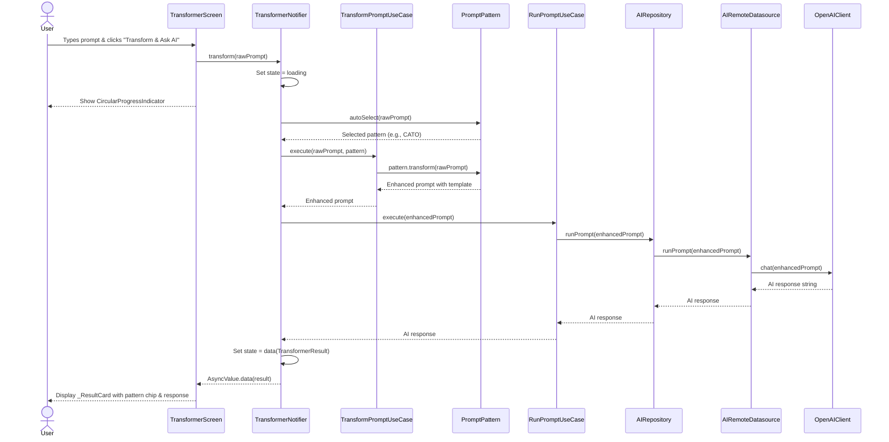
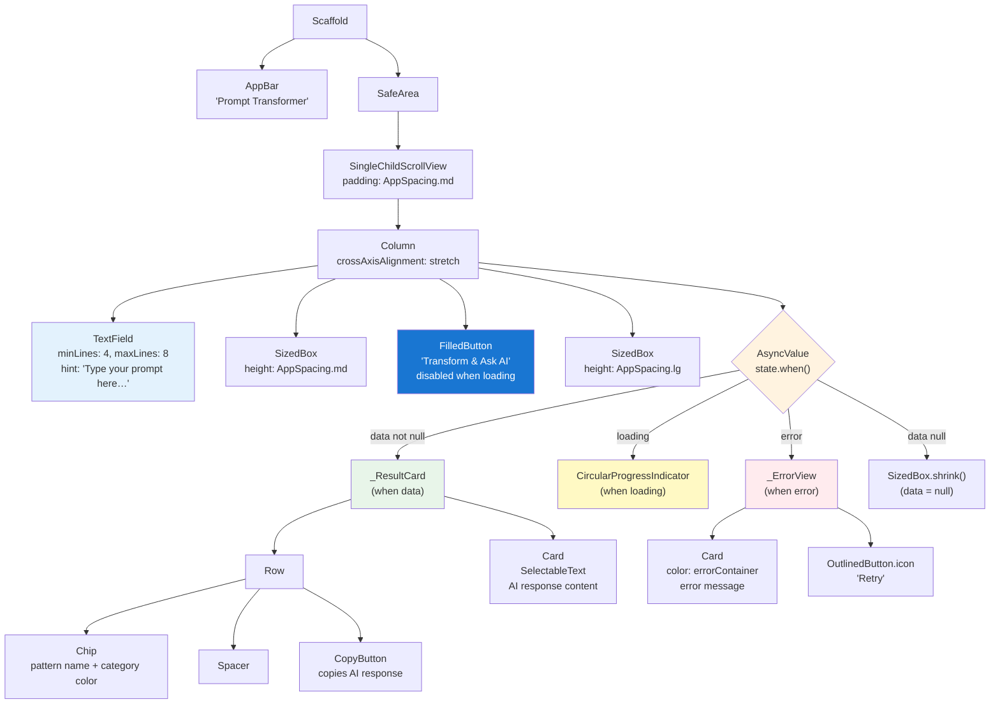

# Transformer Screen

## Summary
The Transformer Screen is the core UI of Prompt App where users input simple, natural-language prompts, select or auto-detect a prompt pattern, and receive AI-enhanced responses. It transforms basic user input into well-structured prompts using proven pattern frameworks, then executes them against OpenAI's API.

## Business Rules
- Empty or whitespace-only input must be ignored (no API call made)
- Pattern is auto-selected based on keyword analysis of user input (fallback: CATO pattern)
- Enhanced prompt is constructed by template replacement (`{{rawPrompt}}` → user input)
- AI response is retrieved via OpenAI chat endpoint and displayed with pattern metadata
- Copy button provides visual feedback (check icon for 2 seconds) after copying to clipboard
- Loading state prevents multiple concurrent submissions
- Network errors display in error card with retry option

## Architecture Overview
**Layers affected:** Presentation / Domain / Data / Network

**Data flow:**
User input → `TransformerNotifier` → `TransformPromptUseCase` (local pattern transform) + `RunPromptUseCase` → `AIRepository` → `AIRemoteDatasource` → `OpenAIClient` → API response → UI

**Data flow sequence:**



**Key providers:**
- `transformerProvider` — AsyncNotifier that orchestrates the transform workflow and holds `TransformerResult?` state
- `runPromptUseCaseProvider` — Provides `RunPromptUseCase` with injected `AIRepository`

**State management:**
- `AsyncValue<TransformerResult?>` holds: raw prompt, selected pattern, enhanced prompt, AI response
- States: `data(null)` (initial), `loading` (during API call), `data(result)` (success), `error` (failure)

**UI Layout:**



## Prompt Pattern Involvement
The feature uses 5 built-in patterns with auto-selection logic:

| Pattern ID | Name | Category | Selection Trigger |
|---|---|---|---|
| `role-based` | Role-based | roleBased | Keywords: expert, as a, act as, you are, role, specialist |
| `chain-of-thought` | Chain of Thought | chainOfThought | Keywords: step, how, explain, why, process, guide, work |
| `few-shot` | Few-Shot | fewShot | Keywords: example, like, similar, compare, instance |
| `risen` | RISEN | risen | Keywords: goal, achieve, improve, plan, result, strategy |
| `cato` | CATO | cato | Default fallback |

**Transformation:**
```dart
template.replaceAll('{{rawPrompt}}', rawPrompt.trim())
```

**Example (CATO):**
```
Input: "summarize this article"
Output: "Context: You are helping with the following: summarize this article
         Action: Provide a clear, structured response.
         Target: Address all aspects of the request.
         Output: Format your response for maximum clarity and usefulness."
```

## Key Files & Symbols

| File | Symbol | Purpose |
|---|---|---|
| `lib/features/transformer/presentation/screens/transformer_screen.dart` | `TransformerScreen` | Main UI: input field, submit button, result display, error handling |
| `lib/features/transformer/presentation/notifiers/transformer_notifier.dart` | `TransformerNotifier` | Orchestrates transform workflow: auto-select pattern → transform → run AI → emit result |
| `lib/features/transformer/presentation/notifiers/transformer_notifier.dart` | `TransformerResult` | Data class holding raw prompt, pattern, enhanced prompt, AI response |
| `lib/features/transformer/domain/entities/prompt_pattern.dart` | `PromptPattern` | Entity defining pattern structure, template transformation, and auto-selection logic |
| `lib/features/transformer/domain/usecases/transform_prompt_use_case.dart` | `TransformPromptUseCase` | Pure function: applies pattern template to raw prompt |
| `lib/features/transformer/domain/usecases/run_prompt_use_case.dart` | `RunPromptUseCase` | Calls repository to execute enhanced prompt via AI API |
| `lib/features/transformer/domain/repositories/ai_repository.dart` | `AIRepository` | Abstract interface for AI prompt execution |
| `lib/features/transformer/data/repositories/ai_repository_impl.dart` | `AIRepositoryImpl` | Concrete repository delegating to datasource |
| `lib/features/transformer/data/datasources/ai_remote_datasource.dart` | `AIRemoteDatasource` | Remote data source wrapping OpenAI client |
| `lib/core/network/openai_client.dart` | `OpenAIClient` | HTTP client for OpenAI chat completions API |
| `lib/shared/widgets/copy_button.dart` | `CopyButton` | Reusable widget for copying text to clipboard with feedback |

## API Contracts
**Endpoint:** OpenAI Chat Completions API (via `OpenAIClient.chat`)

- **Method:** POST
- **Request:** `{ "model": "...", "messages": [{"role": "user", "content": enhancedPrompt}] }`
- **Response:** Parsed to extract assistant message content (string)
- **Error handling:** Network errors caught in `AsyncValue.guard`, displayed in `_ErrorView`

## Edge Cases & Error Handling
- **Empty input** → Ignored (early return in `transform()`, no state change)
- **Network unavailable** → Error caught by `AsyncValue.guard`, displayed in red error card with retry button
- **API rate limit or auth failure** → Error displayed in `_ErrorView` with full error message
- **Concurrent submissions** → Prevented via `state.isLoading` check (submit button disabled)
- **Pattern selection fallback** → If no keywords match, defaults to CATO pattern

## Test Coverage
- [ ] No tests written yet for `TransformerScreen`, `TransformerNotifier`, or use cases
- [ ] Recommended: Unit tests for `PromptPattern.autoSelect()` logic
- [ ] Recommended: Widget test for `TransformerScreen` user flow
- [ ] Recommended: Mock test for `TransformerNotifier.transform()` with mock repository

## Open Questions
- Should pattern selection be manual (user-selectable dropdown) or remain auto-only?
- Should we persist transform history locally for future "History" feature?
- Should enhanced prompt (before AI response) be displayed to user?

## Sources
- **Files read:**
  - `lib/features/transformer/presentation/screens/transformer_screen.dart`
  - `lib/features/transformer/presentation/notifiers/transformer_notifier.dart`
  - `lib/features/transformer/domain/entities/prompt_pattern.dart`
  - `lib/features/transformer/domain/usecases/transform_prompt_use_case.dart`
  - `lib/features/transformer/domain/usecases/run_prompt_use_case.dart`
  - `lib/features/transformer/domain/repositories/ai_repository.dart`
  - `lib/features/transformer/data/repositories/ai_repository_impl.dart`
  - `lib/features/transformer/data/datasources/ai_remote_datasource.dart`
  - `lib/shared/widgets/copy_button.dart`
  - `README.md`
- **Git diff:** Current branch vs main (17 Dart files modified including all transformer layers)
- **Generated:** May 13, 2026
